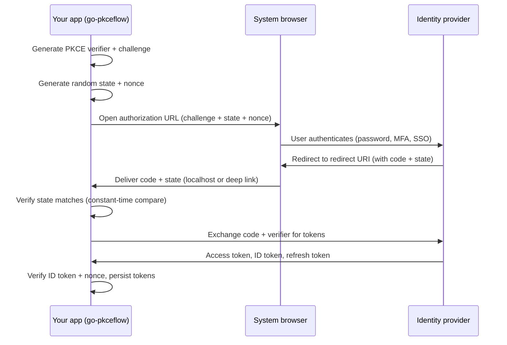

# How It Works (the plain-language version)

This guide explains what go-pkceflow does and why, without assuming you already
know OAuth or OpenID Connect. If you just want code, jump to the
[README](../README.md). If a term is unfamiliar, check the
[glossary](#glossary) at the bottom.

## The problem in one sentence

Your desktop or mobile app needs to let a user log in with an existing account
(their company Keycloak, their Google account, Auth0, Entra ID, and so on), and
then call APIs on their behalf, without your app ever handling their password.

## The old, unsafe way

A naive app might show its own username and password box, collect the
credentials, and send them somewhere. That means your app sees the password,
can store it by accident, and cannot support multi-factor authentication or
single sign-on. Every serious identity provider tells you not to do this.

## The modern way: send the user to the IdP

Instead, your app hands the login off to the identity provider (IdP). The user
types their password on the IdP's own web page, in a real browser, and your app
never sees it. When the IdP is satisfied, it sends the user back to your app
with a short-lived, one-time code. Your app trades that code for tokens.

That handoff is the OAuth 2.0 Authorization Code flow. Doing it safely in a
native app (where there is no server-side secret to protect) requires an extra
step called PKCE. go-pkceflow implements all of it.

## PKCE, explained with a coat check

Imagine you leave a coat at a coat check but you do not fully trust the ticket
system. So before handing over the coat you:

1. Pick a long random secret (the "verifier").
2. Lock it in a box and write the box's fingerprint (a hash) on your ticket.
3. Hand the coat check only the fingerprint, never the secret itself.

Later, to collect the coat, you show the original secret. The attendant hashes
it, checks it matches the fingerprint on file, and only then returns the coat.

In OAuth terms:

- The **verifier** is a random string your app generates and keeps in memory.
- The **challenge** is its SHA-256 hash (the fingerprint). Your app sends only
  this to the IdP when starting login.
- When your app later exchanges the code for tokens, it sends the original
  verifier. The IdP hashes it and checks it against the challenge it stored.

If an attacker intercepts the one-time code (for example, another app on the
same device registering the same URL scheme), they still cannot use it, because
they never had the verifier. go-pkceflow uses the S256 (SHA-256) method only.
The weaker "plain" method is not supported.

## The full flow, step by step

The two native-specific steps ("Deliver code + state" and how the browser is
opened) are exactly the parts that differ between desktop and mobile. That is
why go-pkceflow puts them behind a small interface (`AuthFlowHandler`) and ships
a desktop implementation, while letting mobile apps provide their own.

## How the callback comes back

The IdP can only send the user back to a **redirect URI** that was registered in
advance. go-pkceflow supports the two native patterns:

- **Desktop**: the app briefly runs a tiny web server on localhost (for example
  `http://127.0.0.1:15051/callback`) and the IdP redirects there. This follows
  the loopback pattern in RFC 8252. go-pkceflow runs a single shared server (the
  "broker") that can handle several logins and a logout at once without port
  conflicts, matching each callback to the flow that started it by its `state`.
- **Mobile**: the app registers a custom URL scheme or an App Link / Universal
  Link. The OS routes the redirect back into the app, which hands the URL to
  go-pkceflow. See [mobile deep linking](mobile-deep-linking.md).

## What the tokens are for

After a successful login the app holds up to three tokens:

- **Access token**: the key you attach to API requests (`Authorization: Bearer
  ...`). It is short-lived and **opaque**: your app should treat it as a random
  string and never try to read its contents. go-pkceflow deliberately does not
  decode it.
- **Refresh token**: used to silently get a new access token when the old one
  expires, so the user does not have to log in again. go-pkceflow's background
  refresh loop does this for you. A provider only returns one when its native
  client and scope settings allow it.
- **ID token**: a signed statement describing *who* the user is (name, email,
  subject id). This one is meant to be read. `client.Claims()` decodes it for
  you after the library has verified it. See [`claims.go`](../claims.go).

The refresh loop waits until half of the access token's original lifetime
remains before its first request. If the provider is temporarily unavailable,
it retries at progressively later lifetime thresholds (one quarter remaining,
then one eighth, and so on) without starting a request after the token expires.
Expiry itself never opens the browser or forces sign-in; the app's configured
grace period still determines whether offline use may continue.

go-pkceflow requests `openid profile email offline_access` by default. The
first three request sign-in and profile claims. `offline_access` asks for a
refresh token, but providers apply their own policy: Keycloak also needs the
offline-access client scope and role mapping, Auth0 may need offline access
enabled for the target API, and some providers use a different authorization
parameter. The [provider setup guides](idp-setup-generic-oidc.md) explain what
to check.

## Logging out

Deleting the local tokens signs the user out of *your app*. To also end the
session at the IdP (so the next login is not silently auto-approved), the app
sends the user to the IdP's end-session endpoint. This is RP-Initiated Logout.

IdPs usually require the post-logout redirect URI to be registered *separately*
from the login redirect URI. go-pkceflow supports configuring a distinct logout
callback path, and correlates the logout round-trip with a `state` value just
like login.

Browser logout is not the same as token revocation. go-pkceflow clears its
in-memory state and asks the configured persistence backend to delete its copy;
a deletion failure is logged because browser/local logout otherwise continues.
The library does not call a provider revocation endpoint. A provider may keep
the discarded refresh/offline grant valid until its own expiry or
administrative revocation policy ends it.

## What this library solves

- Public-client PKCE login and logout for desktop and mobile (no client secret).
- Opening the system browser and capturing the callback on each platform.
- Encrypted, pluggable token storage.
- Automatic background token refresh with an optional offline grace period.
- RP-Initiated Logout with post-logout redirect correlation.
- Reading ID token claims.
- Testing without a real IdP (the `oidctest` package).

## What this library does NOT solve

- **Confidential clients / client secrets.** This library is for public clients
  (native apps) that cannot safely hold a secret. It does not implement flows
  that require a client secret.
- **Backend / server-to-server auth.** No client-credentials grant, no service
  accounts.
- **The deprecated implicit flow.** Authorization Code + PKCE only.
- **Being a resource server.** It does not validate incoming access tokens for
  an API you host. That is the API's job (verify the token against the IdP's
  JWKS).
- **User management, registration, MFA policy, or consent screens.** Those live
  in the IdP.

## Glossary

- **Identity provider (IdP)**: the service that authenticates users and issues
  tokens (Keycloak, Auth0, Entra ID, Google, Okta).
- **Redirect URI**: the pre-registered address the IdP sends the user back to
  after login. For desktop it is a localhost URL; for mobile a deep link.
- **Public client**: an app that cannot keep a secret confidential (anyone can
  inspect a shipped binary). Native apps are public clients. PKCE exists
  precisely so public clients can log in safely.
- **PKCE (Proof Key for Code Exchange, RFC 7636)**: the verifier/challenge
  mechanism described above. It binds the login request to the token exchange so
  a stolen code is useless.
- **State**: a random value the app sends and expects back unchanged, to detect
  cross-site request forgery and to match a callback to the flow that started
  it.
- **Nonce**: a second random value carried inside the signed ID token. It binds
  that token to the login request and detects replay or token injection.
- **Access / refresh / ID token**: see [What the tokens are
  for](#what-the-tokens-are-for).
- **End-session endpoint**: the IdP URL used to log the user out of the IdP
  session (RP-Initiated Logout).

## Next steps

- Set up a local IdP to try it: [Keycloak guide](idp-setup-keycloak.md).
- Use a hosted IdP: [Auth0 guide](idp-setup-auth0.md).
- Use Microsoft identity: [Entra ID guide](idp-setup-entra.md).
- Check another provider: [generic OIDC guide](idp-setup-generic-oidc.md).
- Ship on phones: [mobile deep linking](mobile-deep-linking.md).
- Understand the internals: [architecture](architecture.md).
