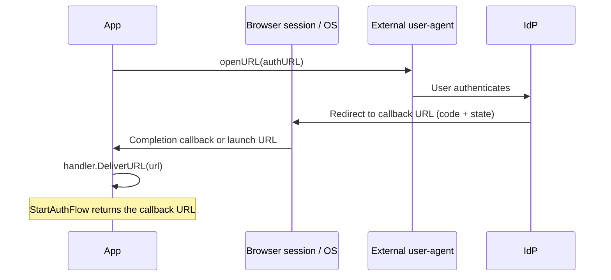

# Mobile deep linking

On desktop, go-pkceflow captures the login callback with a localhost web server.
Mobile apps instead receive it from a platform browser session's completion
handler or through a **deep link** that the operating system routes into the
app. This guide explains both delivery models, the two link types, and how to
wire the incoming URL into `mobileflow.Handler`.

If you have not read the [how-it-works](how-it-works.md) overview, start there.

## The mobile handler in one picture



`mobileflow.Handler` is deliberately platform-agnostic. You give it two things:

- the **redirect URI** registered with the IdP, and
- an **openURL** function that starts an external user-agent (for example
  `ASWebAuthenticationSession` on iOS or a Chrome Custom Tab on Android). Do
  not use an embedded WebView for login.

When the platform returns the callback URL, call `handler.DeliverURL(url)`.
For `ASWebAuthenticationSession`, do this from its completion handler. For an
App Link, Universal Link, or custom scheme opened by the external browser, do
it from the app's OS lifecycle callback.
Malformed URLs and links that do not match the active flow's redirect URI and
state are ignored, so an unrelated app link cannot unblock login. See
[`mobileflow/mobileflow.go`](../mobileflow/mobileflow.go).

This is the core library boundary: `mobileflow` invokes the supplied URL opener,
waits for a callback, and validates a URL once it is delivered. Registering
links with the OS and transporting the launch URL through a native bridge or
application framework are consumer or adapter responsibilities. Core tests
therefore prove callback handling, not a particular framework's Android or iOS
host delivery.

The active callback waiter and its surrounding login or logout transaction live
only in process memory. If the app process dies, a later launch URL has no
active flow and is ignored; start the flow again. Cold-launch URL delivery can
prove host plumbing, but it does not prove OAuth transaction recovery.

```go
handler := mobileflow.New("https://app.example.com/auth/callback", openURL)
client, _ := pkceflow.New(cfg, handler)

// Somewhere in your platform's deep link callback:
handler.DeliverURL(incomingURL)
```

## Two kinds of deep link

### HTTPS app links (recommended)

These are ordinary `https://` URLs whose app association the operating system
verifies against files hosted on your domain. Correctly verified links provide
stronger routing assurance than custom schemes, which is why they are preferred
for OAuth callbacks.

- **iOS: Universal Links.** Host an
  `apple-app-site-association` JSON file at
  `https://app.example.com/.well-known/apple-app-site-association` listing your
  app's identifier and the paths it claims (for example `/auth/callback`). Add
  the matching Associated Domains entitlement (`applinks:app.example.com`) to
  your app.
- **Android: App Links.** Host an `assetlinks.json` file at
  `https://app.example.com/.well-known/assetlinks.json` with your app's package
  name and signing certificate fingerprint. Declare an intent filter with
  `android:autoVerify="true"` for the `https` scheme and your host.

Your redirect URI is then the claimed HTTPS URL, for example
`https://app.example.com/auth/callback`. Register that exact value with the IdP.

### Custom URL schemes (simpler, weaker)

A custom scheme such as `com.example.app://auth/callback` is easier to set up
because it needs no hosted verification file, but any app can register the same
scheme, so it offers weaker protection against callback interception. PKCE still
protects the code exchange, but prefer HTTPS app links where you can.

- **iOS**: add the scheme under `CFBundleURLTypes` in `Info.plist`.
- **Android**: declare an intent filter for your custom scheme.

Your redirect URI is then `com.example.app://auth/callback`, registered with the
IdP.

## Wiring the incoming URL into your app

Whatever the platform, the pattern is the same: a browser-session completion or
OS lifecycle callback gives you a URL, and you pass it to `DeliverURL`.

It is safe to forward every launch URL from the platform integration. The
handler accepts only the expected scheme, host, port, path, fixed redirect query
parameters, and OAuth state. Deliveries made when no flow is active are dropped.
Only one mobile login or logout browser flow can be active at a time; a second
attempt returns `mobileflow.ErrFlowInProgress`.

This guard protects callback routing inside the handler. It does not serialize
the handler across separate Client instances. Within one Client, core lifecycle
ordering cancels the older login/logout operation and waits for its handler call
to release before starting the replacement; overlapping Logout calls coalesce.
Framework-level busy guards remain useful for avoiding overlapping browser UX,
but are not the correctness boundary.

### iOS (conceptually)

When using `ASWebAuthenticationSession`, its completion handler receives the
callback directly and should bridge it to `DeliverURL`. If the app instead
receives an OS-routed Universal Link or custom-scheme URL, SwiftUI can forward
that URL:

```swift
.onOpenURL { url in
    bridge.deliverURL(url.absoluteString) // calls handler.DeliverURL on the Go side
}
```

### Android (Kotlin, conceptually)

```kotlin
private fun deliverCallback(intent: Intent?) {
    intent?.data?.let { uri ->
        bridge.deliverURL(uri.toString()) // calls handler.DeliverURL on the Go side
    }
}

override fun onCreate(savedInstanceState: Bundle?) {
    super.onCreate(savedInstanceState)
    deliverCallback(intent) // cold launch
}

override fun onNewIntent(intent: Intent) {
    super.onNewIntent(intent)
    setIntent(intent)
    deliverCallback(intent) // warm launch with singleTask/singleTop as configured
}
```

The exact bridge between your native layer and the Go layer depends on your
toolchain (gomobile, a Wails mobile target, or a custom FFI). The Go side is
always just `handler.DeliverURL(url)`.

## Logout on mobile

RP-Initiated Logout works the same way: the IdP redirects to a post-logout deep
link after ending the session. Register a post-logout redirect URI with the IdP
(a separate entry from the login callback, just like on desktop) and deliver the
returning URL the same way. The core `Client.Logout` carries a `state` value so
the logout round-trip can be correlated. Providers that omit state from the
logout callback remain supported, but only when the delivered URL matches the
configured post-logout redirect URI. Prefer a distinct logout callback URI when
your provider omits state, because the compatibility path has weaker
correlation than an exact state match.

## Checklist

- [ ] Decide HTTPS app links (preferred) vs custom scheme.
- [ ] Host the verification file (`apple-app-site-association` /
      `assetlinks.json`) if using HTTPS links.
- [ ] Add the platform entitlement / intent filter.
- [ ] Register the redirect URI (and a post-logout URI) with the IdP.
- [ ] Implement `openURL` using a secure in-app browser session.
- [ ] Call `handler.DeliverURL(url)` from the browser-session completion or OS
      deep-link callback.

## See also

- [How it works](how-it-works.md)
- [Architecture](architecture.md)
- [`mobileflow`](../mobileflow/) package
