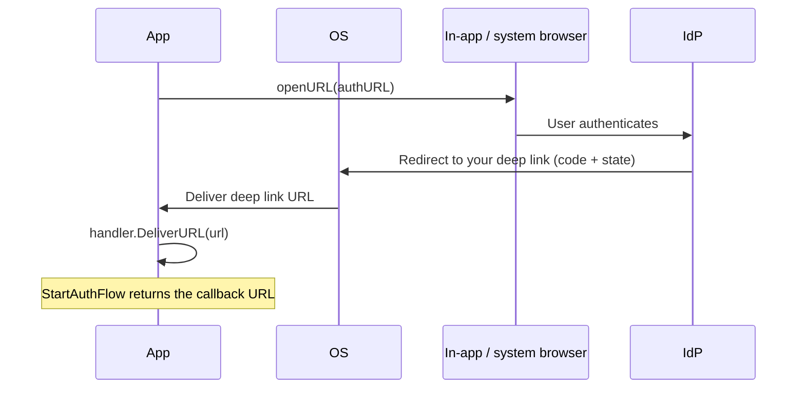

# Mobile deep linking

On desktop, go-pkceflow captures the login callback with a localhost web server.
Phones do not allow that, so mobile apps receive the callback through a **deep
link**: a URL that the operating system routes back into your app. This guide
explains the two link types, how to register them, and how to wire the incoming
URL into `mobileflow.Handler`.

If you have not read the [how-it-works](how-it-works.md) overview, start there.

## The mobile handler in one picture



`mobileflow.Handler` is deliberately platform-agnostic. You give it two things:

- the **redirect URI** registered with the IdP, and
- an **openURL** function that opens the auth URL (for example via
  `ASWebAuthenticationSession` on iOS or a Chrome Custom Tab on Android).

When the OS hands your app the redirect URL, you call `handler.DeliverURL(url)`
and the blocked `StartAuthFlow` returns. See
[`mobileflow/mobileflow.go`](../mobileflow/mobileflow.go).

```go
handler := mobileflow.New("https://app.example.com/auth/callback", openURL)
client, _ := pkceflow.New(cfg, handler)

// Somewhere in your platform's deep link callback:
handler.DeliverURL(incomingURL)
```

## Two kinds of deep link

### HTTPS app links (recommended)

These are ordinary `https://` URLs that you *prove ownership of*, so only your
app can claim them. They cannot be hijacked by another app, which is why they
are preferred for OAuth callbacks.

- **iOS: Universal Links.** Host an
  `apple-app-site-association` JSON file at
  `https://app.example.com/.well-known/apple-app-site-association` listing your
  app's identifier and the paths it claims (for example `/auth/callback`). Add
  the matching Associated Domains entitlement (`applinks:app.example.com`) to
  your app.
- **Android: App Links.** Host an `assetlinks.json` file at
  `https://app.example.com/.well-known/assetlinks.json` with your app's package
  name and signing certificate fingerprint. Declare an intent filter with
  `android:autoVerify="true"` for the `https` scheme and your host.

Your redirect URI is then the claimed HTTPS URL, for example
`https://app.example.com/auth/callback`. Register that exact value with the IdP.

### Custom URL schemes (simpler, weaker)

A custom scheme such as `com.example.app://auth/callback` is easier to set up
because it needs no hosted verification file, but any app can register the same
scheme, so it offers weaker protection against callback interception. PKCE still
protects the code exchange, but prefer HTTPS app links where you can.

- **iOS**: add the scheme under `CFBundleURLTypes` in `Info.plist`.
- **Android**: declare an intent filter for your custom scheme.

Your redirect URI is then `com.example.app://auth/callback`, registered with the
IdP.

## Wiring the incoming URL into your app

Whatever the platform, the pattern is the same: the OS gives you a URL, you pass
it to `DeliverURL`.

### iOS (SwiftUI, conceptually)

```swift
// Universal Link
.onOpenURL { url in
    bridge.deliverURL(url.absoluteString) // calls handler.DeliverURL on the Go side
}
```

### Android (Kotlin, conceptually)

```kotlin
override fun onNewIntent(intent: Intent) {
    super.onNewIntent(intent)
    intent.data?.let { uri ->
        bridge.deliverURL(uri.toString()) // calls handler.DeliverURL on the Go side
    }
}
```

The exact bridge between your native layer and the Go layer depends on your
toolchain (gomobile, a Wails mobile target, or a custom FFI). The Go side is
always just `handler.DeliverURL(url)`.

## Logout on mobile

RP-Initiated Logout works the same way: the IdP redirects to a post-logout deep
link after ending the session. Register a post-logout redirect URI with the IdP
(a separate entry from the login callback, just like on desktop) and deliver the
returning URL the same way. The core `Client.Logout` carries a `state` value so
the logout round-trip can be correlated; for the same-URI case the standard
`StartAuthFlow` path plus that `state` is sufficient.

## Checklist

- [ ] Decide HTTPS app links (preferred) vs custom scheme.
- [ ] Host the verification file (`apple-app-site-association` /
      `assetlinks.json`) if using HTTPS links.
- [ ] Add the platform entitlement / intent filter.
- [ ] Register the redirect URI (and a post-logout URI) with the IdP.
- [ ] Implement `openURL` using a secure in-app browser session.
- [ ] Call `handler.DeliverURL(url)` from the OS deep link callback.

## See also

- [How it works](how-it-works.md)
- [Architecture](architecture.md)
- [`mobileflow`](../mobileflow/) package
